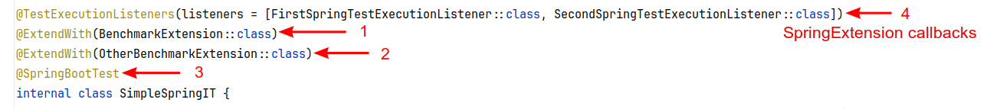
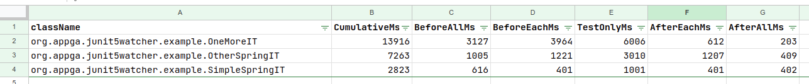

# Junit5 Watcher Extension

Watcher is Junit5 extension that can measure the execution of JUnit tests and provides detailed metrics, for different test stages  (`before/after`, `all/each`). The metrics report is the first thing you may want to do before optimizing the time of execution of your test suite.
Detailed test metrics result is beneficial for integration tests particularly. In long-lived projects, the integration tests may take a significant part of your CI/CD pipeline. In that case, the bottleneck of your tests may be hidden in the initialization phase (e.g. `before all` or `before each` methods) which usually tends to be overlooked by developers.
This extension lets you measure not only the cumulative time of your test classes' execution time but also callbacks `before/after` triggered by other test extensions (Spring Extension particularly)

## How to use the extension

### Dependencies

Extension requires JDK 17.

You have to define Maven or Gradle new dependencies (in `test` scope).

Maven dependencies:
```xml
<dependency>
    <groupId>org.appga.junit5</groupId>
    <artifactId>junit5-watcher-ext</artifactId>
    <version>1.0</version>
    <scope>test</scope>
</dependency>
```

Extension is compiled with Kotlin 1.9. If your project uses directly or indirectly Kotlin 1.6.x or older already, you may need to update to at least 1.8.x. In that case please update kotlin-stdlib:

```xml
<dependency>
    <groupId>org.jetbrains.kotlin</groupId>
    <artifactId>kotlin-stdlib</artifactId>
    <version>1.8.20</version>
    <scope>test</scope>
</dependency>
```

The extension can be used in your project in one of two methods provided by JUnit5.

### Automatic usage
Watcher Extension can be automatically launched in your test suite by running it with Java property `-Djunit.jupiter.extensions.autodetection.enabled=true`

See more details in [JUnit5 documentation](https://junit.org/junit5/docs/current/user-guide/#extensions-registration-automatic)

### Declarative usage
The second way of using the extension is by explicit declaration using JUnit5 `@ExtendWith` annotation. 

#### Extensions order
If the extension is defined in a declarative way, please make sure the Watcher is the first extension registered in the class (or base class). This is required to measure properly other extensions' callbacks. This condition includes also `@SpringBootTest` annotation (as it effectively registers `SpringExtension` declaration)



## Analysis output
Watcher Extension generates the metrics report on process shutdown. At this moment CSV file format is supported only.

### CSV Report
CSV metrics report is generated in default directory with fixed name `test-metrics-report.csv`



