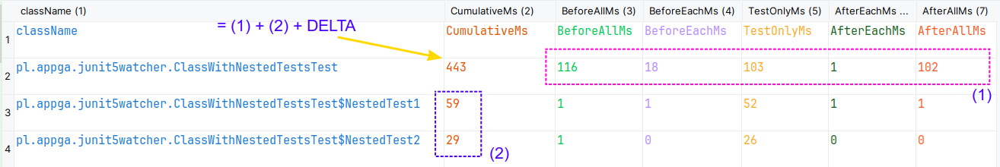

# Junit5 Watcher Extension

Watcher is Junit5 extension that can measure the execution of JUnit tests and provides detailed metrics, for different test stages  (`before/after`, `all/each`). The metrics report is the first thing you may want to do before optimizing the time of execution of your test suite.

Detailed test metrics result is beneficial for integration tests particularly. In long-lived projects, the integration tests may take a significant part of your CI/CD pipeline. In that case, the bottleneck of your tests may be hidden in the initialization phase (e.g. `before all` or `before each` methods) which usually tends to be overlooked by developers.

Some IDEs report test execution time, but provided values tend to ignore pre-/post-class callbacks. Most likely you may see value representing only pure test execution time + pre-test callback (BeforeEach). However, some more advanced Spring Boot integration tests can spend significant time on Spring context initialization or database data prefilling.

This extension lets you measure not only the cumulative time of your test classes' execution time but also callbacks `before/after` triggered by other test extensions (Spring Extension particularly)

## How to use the extension

### Dependencies

Extension requires JDK 17.

You have to define Maven or Gradle new dependencies (in `test` scope).

Maven dependencies:
```xml
<dependency>
    <groupId>pl.appga.junit5</groupId>
    <artifactId>junit5-watcher-ext</artifactId>
    <version>1.1</version>
    <scope>test</scope>
</dependency>
```

The extension is compiled with Kotlin 1.9. If your project uses directly or indirectly Kotlin 1.6.x or older already, you may need to update to at least 1.8.x. In that case please update kotlin-stdlib:

```xml
<dependency>
    <groupId>org.jetbrains.kotlin</groupId>
    <artifactId>kotlin-stdlib</artifactId>
    <version>1.8.20</version>
    <scope>test</scope>
</dependency>
```

The extension can be used in your project in one of two methods provided by JUnit5.

### Automatic usage
Watcher Extension can be automatically launched in your test suite by running it with Java property `-Djunit.jupiter.extensions.autodetection.enabled=true`

See more details in [JUnit5 documentation](https://junit.org/junit5/docs/current/user-guide/#extensions-registration-automatic)

### Declarative usage
The second way of using the extension is by explicit declaration using JUnit5 `@ExtendWith` annotation.

#### Extensions order
If the extension is defined in a declarative way, please make sure the Watcher is the first extension registered in the class (or base class). This is required to measure properly other extensions' callbacks. This condition includes also `@SpringBootTest` annotation (as it effectively registers `SpringExtension` declaration)


## Analysis output
Watcher Extension generates the metrics report on process shutdown. At this moment CSV file format is supported only.

### CSV Report
CSV metrics report is generated in default directory with fixed name `test-metrics-report.csv`


## Disabled classes/tests

If the whole test class is disabled by JUnit annotation `@Disabled` then it's not included at all in the final report, as it's never triggered by JUnit. Otherwise, the report will certainly contain at least a cumulative time metric. The existence of other metrics depends on how many tests were triggered by JUnit engine.

If a test class doesn't contain any active test, or all individual tests are disabled, then JUnit does not trigger any before/after callback. In that case, the report will contain only cumulative value. However, if at least one test is executed, then before/after metrics will be measured too.

The same behavior applies to nested classes.


## Order of callbacks execution

The schema of callback executions is as following: 

* **For test class**:
   * (1) JUnit5-watcher -> `beforeAll`
   * Other extension -> `beforeAll` (TestExecutionListener -> `beforeTestClass`)
   * `@BeforeAll` for test class
     * **For every @Test**
       * (2) JUnit5-watcher -> `beforeEach`
       * Other extension -> `beforeEach` (TestExecutionListener -> `beforeTestMethod`)
       * `@BeforeEach` for test
         * (3) JUnit5-watcher -> `beforeTestExecution`
         * **Actual test code**
         * (4) JUnit5-watcher -> `afterTestExecution`
       * `@AfterEach` for test
       * Other extension -> `afterEach` (TestExecutionListener -> `afterTestMethod`)
       * (5) JUnit5-watcher -> `afterEach`
     * **For every @Nested test**
       * (6) JUnit5-watcher -> `beforeAll`
       * Other extension -> `beforeAll` (TestExecutionListener -> `beforeTestClass`)
       * `@BeforeAll` for nested test class
         * **For every @Test in @Nested class**
           * (7) JUnit5-watcher -> `beforeEach`
           * Other extension -> `beforeEach` (TestExecutionListener -> `beforeTestMethod`)
           * `@BeforeEach` for test
             * (8) JUnit5-watcher -> `beforeTestExecution`
             * **Actual test code in nested class**
             * (9) JUnit5-watcher -> `afterTestExecution`
           * `@AfterEach` for test
           * Other extension -> `afterEach` (TestExecutionListener -> `afterTestMethod`)
           * (10) JUnit5-watcher -> `afterEach`
       * `@AfterAll` for nested test class
       * Other extension -> `afterAll` (TestExecutionListener -> `afterTestClass`)
       * (11) JUnit5-watcher -> `afterAll`     
   * `@AfterAll` for test class
   * Other extension -> `afterAll` (TestExecutionListener -> `afterTestClass`)
   * (12) JUnit5-watcher -> `afterAll`

If you use Spring integration tests then `SpringExtension` allows you to define additional test callback class (implementing  `TestExecutionListener` interface). In that case `junit5-watcher` will count in the metrics time spent on these callbacks too.

Nested test in the example is optional. `@BeforeAll` and `@AfterAll` callbacks for nested tests can work only with JDK16+. See [JUnit5 documentation for nested classes](https://junit.org/junit5/docs/current/user-guide/#writing-tests-nested).

Metrics are calculated in the following way:

* `BeforeAllMs` -> time elapsed between `(1)` and `(2)`
* `BeforeEachMs` -> time elapsed between `(2)` and `(3)`
* `TestOnlyMs` -> time elapsed between `(3)` and `(4)`
* `AfterEachMs` -> time elapsed between `(4)` and `(5)`
* `AfterAllMs` -> time elapsed between last call to `(5)` and `(12)` (or `(11)` and `(12)` if nested class is used)
* `CumulativeMs` -> time elapsed between `(1)` and `(12)`

A similar approach is used for calculating metrics for nested classes using time marks starting `(6)` up to `(11)`.

In rare situations, every individual test in a class may be disabled. In that case, callback `before/after each` test won't be triggered. The extension should handle this case properly and measure just `before/after all` callbacks.

## Test cumulative value

The cumulative time value for every enclosing class matches the following formula:

* **Cumulative time** = Before All + Before Each + Test time + After Each + After All + *(Nested classes cumulative time)* + ***DELTA***

  * where ***DELTA*** represents the additional time spent in between callbacks (mostly JUnit5 internal processing or other)


The formula is explained visually in this picture:


